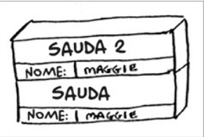

# 📚 Grokking Algorithms

## Capítulo 3 — Recursão

> **Status:**  ✅ Concluído
>
> **Data de estudo:** 02/08/2026

---

## 🎯 Objetivo do capítulo

O objetivo deste capítulo é compreender o conceito de recursão, como ela funciona, quando utilizá-la e como analisar sua complexidade. A recursão é uma técnica fundamental em algoritmos, permitindo que problemas complexos sejam resolvidos de maneira elegante e eficiente.
Além disso, o capítulo ensina a separar problema em casos base e casos recursivos, além de apresentar exemplos práticos de algoritmos recursivos, como a busca binária e o cálculo do fatorial.

---

## 📖 Conceitos principais

Liste os conceitos abordados.

- Recursão
- Caso base
- Caso recursivo
- Pilha de chamadas
- Frame

---

## 🧠 Resumo

A recursão é a ideia de uma função chamar a si mesma para resolver um problema. Ela é útil para problemas que podem ser divididos em subproblemas menores e semelhantes ao original. A recursão é composta por dois elementos principais: o caso base, que define quando a recursão deve parar, e o caso recursivo, que define como a função se chama novamente.
A pilha de chamadas é uma estrutura de dados que armazena informações sobre as funções em execução. Cada chamada de função adiciona um novo quadro (frame) à pilha, e quando uma função termina, seu quadro é removido da pilha. Se a recursão não tiver um caso base ou se o caso base não for alcançado, a pilha de chamadas pode crescer indefinidamente, resultando em um erro de estouro de pilha (stack overflow).

---

## 📚 Novos termos

| Termo | Significado |
| ------- | ------------- |
| Recursão | Técnica de programação onde uma função chama a si mesma. |
| Caso base | Situação em que a recursão deve parar. |
| Caso recursivo | Situação em que a função chama a si mesma. |
| Pilha de chamadas | Estrutura de dados que armazena informações sobre as funções em execução. |
| Stack overflow | Erro que ocorre quando a pilha de chamadas excede seu limite de memória. |
| Frame | Quadro de informações armazenado na pilha de chamadas para cada função em execução. |

---

## 📝 Exemplo do livro

### Problema

Suponha que você esteja vasculhando o porão de sua avó e encontre uma
misteriosa mala trancada.

A sua avó diz que a chave para a mala provavelmente está em uma caixa.
Esta caixa contém mais caixas com mais caixas dentro delas. A chave está
em alguma destas caixas.

Qual é o seu algoritmo para procurá-la?

### Entrada

```text
{
  "caixa1": {
    "caixa2": {
      "caixa3": {
        "caixa3": {
            ... {
              "caixaN": {
                "chave": "encontrada"
            }
          }
        }
      }
    }
  }
}
```

### Saída

```text
{
  "chave": "encontrada"
}
```

### Passo a passo

1. Abra a caixa atual.
2. Se a caixa contém a chave, retorne a chave.
3. Se a caixa não contém a chave, abra a próxima caixa e repita os passos 1 e 2.
4. Se não houver mais caixas, retorne uma mensagem de que a chave não foi encontrada.

---

## 💻 Implementação

### JavaScript / TypeScript

```ts
function procurarChave(caixa: object): string | null {
    // Caso base: se a caixa contém a chave, retorne a chave
    if ('chave' in caixa) {
        return caixa['chave'];
    }

    // Caso base: se não houver mais caixas, retorne null
    if (Object.keys(caixa).length === 0) {
        return null;
    }

    // Caso recursivo: abra a próxima caixa e repita o processo
    return procurarChave(caixa[Object.keys(caixa)[0]]);
}

```

### Explicação

O código acima implementa a busca pela chave de forma recursiva. A função `procurarChave` recebe um objeto representando a caixa atual. Ela verifica se a chave está presente na caixa; se estiver, retorna a chave. Caso contrário, verifica se há mais caixas para abrir e chama a função recursivamente na próxima caixa. Se não houver mais caixas, retorna `null`, indicando que a chave não foi encontrada.

---

## ✅ Exercícios do livro

### Exercício 3.1

**Enunciado:**

> Suponha que eu forneça uma pilha de chamada como esta:
> <p align="center">
>   
> </p>
> Quais informações você pode retirar baseando-se apenas nesta pilha de chamada?

**Minha resposta:**

```text
A função sauda é chamada primeiro, com nome = "maggie", chamando a função sauda2.
A função sauda2 é chamada com nome = "maggie".
No estado atual, é visível que a função sauda está aguardando a execução da função sauda2 para que possa continuar e terminar, ou seja, está em estado incompleto e suspenso.
```

**Observações:**

- A pilha de chamadas é uma estrutura de dados que armazena informações sobre as funções em execução.
- Cada chamada de função adiciona um novo quadro (frame) à pilha.
- Quando uma função termina, seu quadro é removido da pilha.

---

### Exercício 3.2

**Enunciado:**

> Suponha que você acidentalmente escreva uma função recursiva que fique executando infinitamente.
> Como você viu, seu computador aloca memória na pilha para cada chamada de função.
> O que acontece com a pilha quando a função recursiva fica executando infinitamente?

**Minha resposta:**

```text
A pilha de chamadas vai crescendo até que a memória alocada para a pilha seja esgotada, resultando em um erro de estouro de pilha (stack overflow).
```

**Observações:**

Cada linguagem de programação tem seu próprio limite de tamanho da pilha, o que pode afetar a quantidade de chamadas recursivas que podem ser feitas antes de ocorrer um estouro de pilha.

- Python: O limite padrão de recursão é 1000, mas pode ser alterado com `sys.setrecursionlimit()`.
- C/C++: O limite de recursão depende do sistema operacional e da configuração do compilador, mas geralmente é maior que em Python.
- Java: O limite de recursão depende da JVM e da configuração do sistema, mas geralmente é maior que em Python e C/C++.
- JS/TS: O limite de recursão depende do ambiente de execução (navegador, Node.js, etc.) e da configuração do sistema, mas geralmente é maior que em Python e C/C++.

---

## ❓Dificuldades encontradas

- Descrever a pilha de chamadas e como ela funciona.
- Entender quando e por que usar recursão.
- Identificar casos base e casos recursivos em problemas complexos.

---

## 🚀 Aplicações práticas

Onde a técnica de recursão é utilizada?

- Problemas de divisão e conquista, como ordenação rápida (quicksort) e busca binária.
- Problemas de backtracking, como o problema das N rainhas e o Sudoku.
- Problemas de grafos, como busca em profundidade (DFS) e busca em largura (BFS).

No geral, problemas que podem ser divididos em subproblemas menores e que possuem uma estrutura recursiva são candidatos ideais para a aplicação de recursão.

---

## ⚠️ Erros comuns

- Esquecer de definir o caso base, resultando em uma recursão infinita.
- Definir o caso base incorretamente, fazendo com que a recursão não termine.
- Usar recursão em problemas que podem ser resolvidos de forma mais eficiente com iteração.

---

## 🔄 Comparação entre técnicas

| Técnica | Quando usar | Quando evitar |
| --------- | ------------- | -------------- |
| Recursão | Para problemas que podem ser divididos em subproblemas menores e semelhantes ao original. | Quando a solução iterativa for mais simples, mais eficiente ou mais legível. |
| Loop | Para repetições com número conhecido de iterações ou quando a lógica é linear. | Quando a solução natural do problema é recursiva e o código ficaria mais claro. |
| Iteração | Para processos sequenciais simples e quando se quer evitar chamadas recursivas. | Quando a estrutura do problema é naturalmente recursiva e a iteração torna a solução mais complexa. |
| Recursão de cauda | Quando a linguagem ou ambiente suporta otimização de recursão de cauda. | Quando não há otimização e a profundidade pode ser grande, aumentando o risco de estouro de pilha. |

---

## 📌 Pontos importantes

- ✔ A pilha de chamadas é uma estrutura de dados que armazena informações sobre as funções em execução.
- ✔ Cada chamada de função adiciona um novo quadro (frame) à pilha, e quando uma função termina, seu quadro é removido da pilha.
- ✔ A recursão é uma técnica poderosa que permite resolver problemas complexos de forma elegante, mas deve ser usada com cuidado para evitar estouro de pilha e garantir eficiência.

---

## 🧩 O que aprendi

A recursão é uma técnica fundamental em algoritmos, permitindo que problemas complexos sejam resolvidos de maneira elegante e eficiente. Compreender a pilha de chamadas, identificar casos base e recursivos, e analisar a complexidade são habilidades essenciais para aplicar a recursão de forma eficaz.
A de utilizar a recursão é como uma boneca russa, onde cada problema pode ser dividido em subproblemas menores, até chegar a um caso base que pode ser resolvido diretamente. Além disso, é importante saber quando usar recursão e quando optar por soluções iterativas, considerando eficiência e legibilidade do código.

---

## 📖 Referências

- Livro: *Grokking Algorithms*

---

## ⭐ Nota pessoal

**Dificuldade:** ⭐⭐☆☆☆

**Domínio do conteúdo:** ⭐⭐⭐⭐☆

**Preciso revisar?**

- [ ] Sim
- [x] Não

---

## 📋 Checklist

- [x] Li o capítulo
- [x] Fiz todos os exercícios
- [x] Implementei os exemplos
- [x] Entendi a complexidade
- [x] Consigo explicar sem consultar o livro
