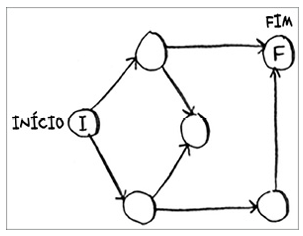
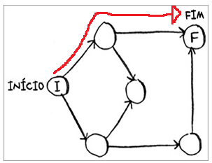
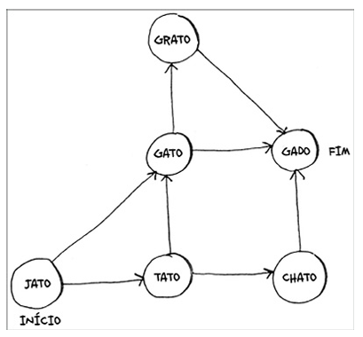
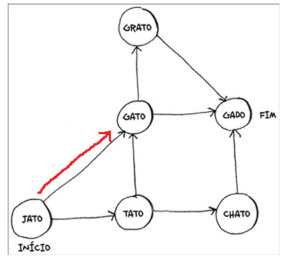
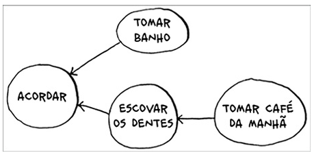
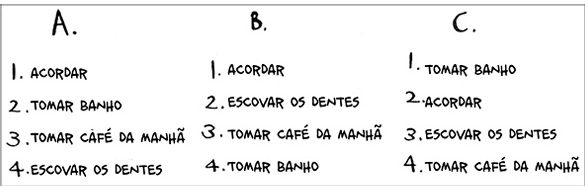
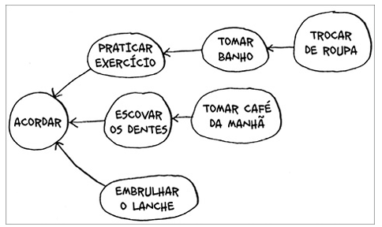
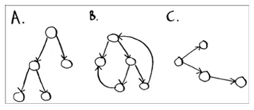

# 📚 Grokking Algorithms

## Capítulo 6 — Pesquisa em largura

> **Status:** ✅ Concluído
>
> **Data de estudo:** 25/09/2026

---

## 🎯 Objetivo do capítulo

O objetivo do capítulo é o de aprender a modelar uma rede usando grafos, apresentar a ideia do algoritmo de BFS (Busca em Largura)
e ofertar o contato inicial com a estrutura de dados de grafos, bem como suas peculiaridades.

---

## 📖 Conceitos principais

- Grafos
- Modelagem
- Busca

---

## 🧠 Resumo

Um grafo é uma forma de representar relações entre elementos: os elementos são
vértices e as relações entre eles são arestas. A busca em largura (BFS) percorre
um grafo usando uma fila, visitando primeiro os vértices mais próximos do ponto
de partida e depois os que estão em níveis seguintes. Em grafos não ponderados,
essa ordem garante que o primeiro caminho encontrado até um vértice seja um dos
caminhos mais curtos. Para evitar ciclos e trabalho repetido, cada vértice deve
ser marcado como visitado antes de ser processado novamente.

> Explique como se estivesse ensinando alguém que nunca viu o assunto.

---

## 📚 Novos termos

| Termo   | Significado                                        |
|---------|----------------------------------------------------|
| Grafo   | Estrutura de dados composta por vértices e arestas |
| Vértice | Elemento do grafo                                  |
| Aresta  | Conexão entre dois vértices                        |
| BFS     | Algoritmo de busca em largura                      |

---

## ⚙️ Algoritmos apresentados

| Algoritmo | Complexidade | Objetivo                                                                                   |
|-----------|--------------|--------------------------------------------------------------------------------------------|
| BFS       |   O(V + E)   |  O objetivo do algoritmo é encontrar o caminho mais curto entre dois vértices em um grafo. |

---

## 💡 Intuição

A ideia por trás do algoritmo de BFS é explorar todos os vértices de um grafo em camadas, começando a partir de um vértice inicial e visitando todos os seus vizinhos antes de passar para os vizinhos dos vizinhos, garantindo assim que o caminho mais curto seja encontrado.
Se você imaginar o grafo como uma rede de cidades conectadas por estradas, o BFS seria como visitar todas as cidades que estão a uma distância de uma estrada do ponto de partida antes de seguir para as cidades que estão a duas estradas de distância, e assim por diante.

---

## 📝 Exemplo do livro

### Problema

Dado um grafo, um vértice objetivo e um vértice de partida pertencentes ao grafo, se é possível encontrar o caminho que inicia no ponto de partida e finaliza no objetivo.

### Entrada

```text
G = (V, E) -> implementado como dicionário com vértice (key) e seus vizinhos (value)
end
start
```

### Saída

```text
Verdadeiro se houver um caminho de start até end; caso contrário, Falso.
```

### Passo a passo

1. Marca vértice como visitado, se for objetivo retorna Verdadeiro
2. Coloca seus vizinhos na fila
3. Volta para (1) até fila voltar a ficar vazia
4. Se fila esvaziou... retorna Falso

---

## 💻 Implementação

### JavaScript / TypeScript

```ts
// Dado como exemplo:
const grafo: Record<string, string[] | []> = {};
grafo["voce"] = ["alice", "bob", "claire"];
grafo["bob"] = ["anuj", "peggy"];
grafo["alice"] = ["peggy"];
grafo["claire"] = ["thom", "jonny"];
grafo["anuj"] = [];
grafo["peggy"] = [];
grafo["thom"] = [];
grafo["jonny"] = [];

// Busca em largura -> Breadth-First Search
function bfs(grafo: Record<string, string[] | []>, start:string, end:string) : boolean {
    const queue:string[] = [];
    queue.push(start);
    
    const visited:string[] = [];

    while (queue.length != 0) {
        let visiting = queue.shift();

        if (visiting !== undefined && !visited.includes(visiting)) {
            if (visiting === end) {
                return true;
            } else {
                queue.push(...grafo[visiting]);
            }
        }
    }
    return false;
}
```

### Explicação

Tenta-se procurar o objetivo na vizinhança do início, caso não esteja, pesquisa na vizinhança dos vizinhos e assim vai indo até esgotarem-se os caminhos ou até encontrar o objetivo.
Esgotados os caminhos, é impossível traçar caminho do início ao objetivo.
Se encontrado, é possível traçar caminho a partir de início ao objetivo.

---

## ✅ Exercícios do livro

### Exercício 6.1

**Enunciado:**


> Encontre o menor caminho do início ao fim.

**Minha resposta:**



**Solução:**

```text
Basta traçar os caminhos possíveis, existem apenas dois caminhos de tamanhos 3 e 2.
Após traçar os caminhos, escolhe-se o menor (2).
```

**Observações:**

A abordagem utilizada para traçar o caminho é irrelevante, mas é interessante tentar fazer o BFS.

---

### Exercício 6.2

**Enunciado:**


> Encontre o menor caminho de “jato” até “gato”

**Minha resposta:**

```text

```

**Solução:**

```text
Mesma ideia da questão 6.1
```

**Observações:**

Não sei se foi um erro de tradução no meu livro, mas a ideia seria a mesma se fosse para caçar qualquer nó a partir de qualquer nó.

---

### Exercício 6.3

**Enunciado:**



> Quanto a estas três listas, marque se elas são válidas ou inválidas



**Minha resposta:**

```text
A: Inválido
B: Válido
C: Inválido
```

**Solução:**

```text
O primeiro item da lista sempre deve ser o "Acordar" pois todos dependem dele.
Assim, A e C não se encaixam como válidos.
Por fim, em B todos estão em ordem de dependência corretas.
```

**Observações:**

Não sei se foi um erro de tradução no meu livro, mas a ideia seria a mesma se fosse para caçar qualquer nó a partir de qualquer nó.

---

### Exercício 6.4

**Enunciado:**


> Aqui temos um grafo maior. Faça uma lista válida para ele

**Minha resposta:**

```text
1. Acordar (obrigatóriamente aqui)
2. Escovar os dentes
3. Praticar exercício
4. Embrulhar lanche
5. Tomar café da manhã
6. Tomar banho
7. Trocar de roupa
```

**Observações:**

Existem diversas soluções válidas, fique livre para propor outra.

---

### Exercício 6.5

**Enunciado:**


> Quais desses grafos também são árvores?

**Minha resposta:**

```text
A e C
```

**Solução:**

```text
O que define árvore é a inexistência de arestas de retorno/ciclo, dessa maneira, A e C não as possuem e B possui, não se encaixando como árvore.
```

---

## ❓Dificuldades encontradas

- Implementação do BFS
- Rastreio do caminho pelo BFS
- Modelagem em grafos

---

## 🚀 Aplicações práticas

Onde esse algoritmo é utilizado?

- Verificador de existência caminho entre vértices
- Achar caminho mínimo entre vértices
- Explorar um grafo

---

## ⚠️ Erros comuns

- Usar pilha ao invés de fila
- Modelar problema incorretamente

---

## 🔄 Comparação com outros algoritmos

| Algoritmo | Quando usar | Quando evitar |
|-----------|-------------|---------------|
| BFS (Pesquisa em largura)| Encontrar o caminho mínimo em grafos não ponderados e explorar vértices por níveis | Grafos com pesos diferentes ou quando o uso de memória da fila for um problema |

---

## 📌 Pontos importantes

- ✔ Entender como modelar o problema em grafos e aplicar seus algoritmos
- ✔ Como explorar um grafo
- ✔ Existem maneiras elegantes de fazer "força bruta"

---

## 🧩 O que aprendi

Aprendi a modelar problemas de conexão com grafos e a usar uma fila para
explorá-los em camadas. Também entendi que o BFS encontra caminhos mínimos em
grafos não ponderados quando os vértices visitados são controlados corretamente.

---

## 📖 Referências

- Livro: *Grokking Algorithms*
- Auxíio da disciplina: Algoritmos em Grafos (UFC)

---

## ⭐ Nota pessoal

**Dificuldade:** ⭐⭐⭐☆☆

**Domínio do conteúdo:** ⭐⭐⭐☆☆

**Preciso revisar?**

- [ ] Sim
- [x] Não

---

## 📋 Checklist

- [x] Li o capítulo
- [x] Fiz todos os exercícios
- [x] Implementei os exemplos
- [x] Entendi a complexidade
- [x] Consigo explicar sem consultar o livro
